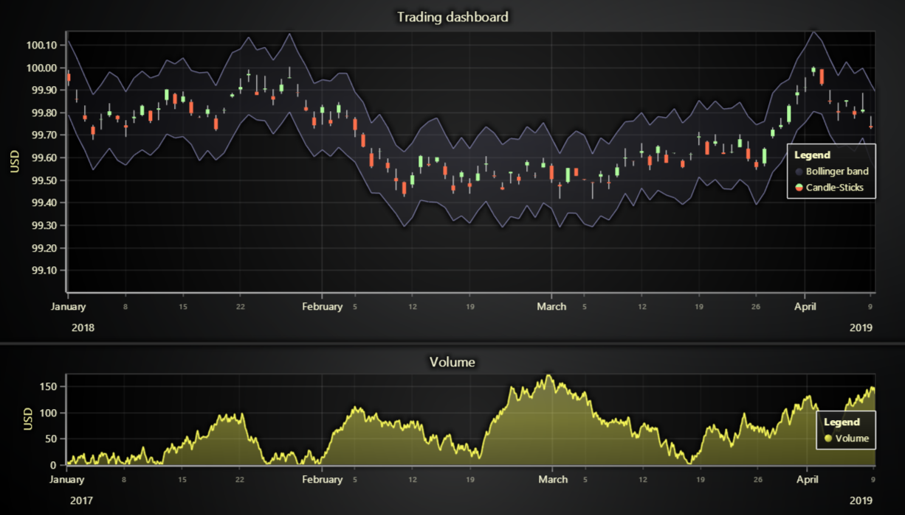

# JavaScript Trading Dashboard



This demo application belongs to the set of examples for LightningChart JS, data visualization library for JavaScript.

LightningChart JS is entirely GPU accelerated and performance optimized charting library for presenting massive amounts of data. It offers an easy way of creating sophisticated and interactive charts and adding them to your website or web application.

The demo can be used as an example or a seed project. Local execution requires the following steps:

-   Make sure that relevant version of [Node.js](https://nodejs.org/en/download/) is installed
-   Open the project folder in a terminal:

          npm install              # fetches dependencies
          npm start                # builds an application and starts the development server

-   The application is available at _http://localhost:8080_ in your browser, webpack-dev-server provides hot reload functionality.


## Description

This example shows the creation of a simple trading dashboard with multiple individual charts on a single pane.

**Please note that using LightningChart JS for Trading use cases requires a special license agreement.**
For more information, please [contact us](https://lightningchart.com/contact/).

The chart contains:

-   Japanese candlesticks ( **_OHLC series_** ) to represent the market price data
-   Mountains area ( **_AreaRange series_** ) to represent the difference between high & low values
-   Mountains area ( **_Area series_** ) to represent the volume

## Legend

Legend in this example is a UI object embedded to the chart using predefined simple builders for horizontal or vertical layout.

-   Horizontal legend

    ```javascript
    // Create a horizontal legend embedded to the chart.
    const legend = chart.addLegendBox(LegendBoxBuilders.HorizontalLegendBox)
    ```

-   Vertical legend

    ```javascript
    // Create a vertical legend embedded to the chart.
    const legend = chart.addLegendBox(LegendBoxBuilders.VerticalLegendBox)
    ```

The whole chart with contained series, the whole dashboard with contained charts and series, or the series individually can be easily attached to the legend box.

-   Adding a chart

    ```javascript
    // Attach the chart and its series to legend.
    // Creates a group with charts.
    const entries = legend.add(chart)
    ```

-   Adding a dashboard

    ```javascript
    // Attach the dashboard with charts with series to legend.
    // Creates groups of charts with series.
    const entries = legend.add(dashboard)
    ```

-   Adding a series

    ```javascript
    // Attach the individual series as a group to legend.
    // Creates a group from a single series.
    const entries = legend.add(series)
    ```


## API Links

* [XY cartesian chart]
* [Axis]
* [Axis tick strategies]
* [Horizontal legend box]
* [Vertical legend box]
* [UI position origins]
* [Solid FillStyle]
* [RGBA color factory]
* [Solid LineStyle]


## Support

If you notice an error in the example code, please open an issue on [GitHub][0] repository of the entire example.

Official [API documentation][1] can be found on [LightningChart][2] website.

If the docs and other materials do not solve your problem as well as implementation help is needed, ask on [StackOverflow][3] (tagged lightningchart).

If you think you found a bug in the LightningChart JavaScript library, please contact sales@lightningchart.com.

Direct developer email support can be purchased through a [Support Plan][4] or by contacting sales@lightningchart.com.

[0]: https://github.com/Arction/
[1]: https://lightningchart.com/lightningchart-js-api-documentation/
[2]: https://lightningchart.com
[3]: https://stackoverflow.com/questions/tagged/lightningchart
[4]: https://lightningchart.com/support-services/

© LightningChart Ltd 2009-2022. All rights reserved.


[XY cartesian chart]: https://lightningchart.com/js-charts/api-documentation/v6.0.0/classes/ChartXY.html
[Axis]: https://lightningchart.com/js-charts/api-documentation/v6.0.0/classes/Axis.html
[Axis tick strategies]: https://lightningchart.com/js-charts/api-documentation/v6.0.0/variables/AxisTickStrategies.html
[Horizontal legend box]: https://lightningchart.com/js-charts/api-documentation/v6.0.0/variables/LegendBoxBuilders.html
[Vertical legend box]: https://lightningchart.com/js-charts/api-documentation/v6.0.0/variables/LegendBoxBuilders.html
[UI position origins]: https://lightningchart.com/js-charts/api-documentation/v6.0.0/variables/UIOrigins.html
[Solid FillStyle]: https://lightningchart.com/js-charts/api-documentation/v6.0.0/classes/SolidFill.html
[RGBA color factory]: https://lightningchart.com/js-charts/api-documentation/v6.0.0/functions/ColorRGBA.html
[Solid LineStyle]: https://lightningchart.com/js-charts/api-documentation/v6.0.0/classes/SolidLine.html

